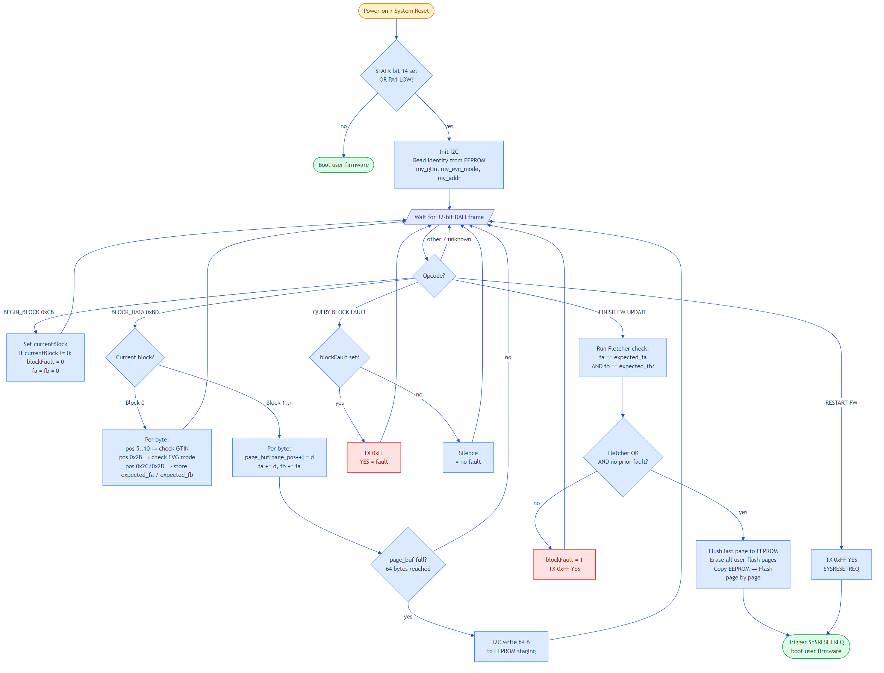

# DALI Bootloader for CH32V003

> **HIGHLY EXPERIMENTAL** — This bootloader has been tested with a custom Pico-based DALI master only. It has NOT been validated against a standard DALI system (e.g., commercial DALI master, multi-device bus). Use at your own risk.

Firmware-over-DALI-bus bootloader for CH32V003. Fits in the 1920-byte boot area. Receives firmware via standard DALI Manchester-encoded frames on the existing DALI RX/TX pins — no additional hardware needed.

**~976 / 1920 bytes (51%)** — leaves room for future enhancements.

## How It Works

- Polling Manchester decoder at 1200 baud (DALI standard timing)
- Reads NVM page (0x08003FC0) for the device's short address — only accepts frames addressed to this device (or broadcast if no address assigned)
- Uses standard DALI 16-bit forward frames with S=1 (command addressing): address byte = `(short_addr << 1) | 1`, data byte = bootloader command
- Backward frame ACK/NAK for flow control (ACK sent per 64-byte flash page)
- Full firmware upload (~10 KB) takes approximately **11 minutes** over the DALI bus (conservative 25ms inter-frame timing)
- **Other devices on the bus are NOT affected** — frames are addressed to a specific short address. Only the target device processes bootloader commands. Command bytes 131–135 are in the IEC 62386-102 vendor-specific reserved range (129–143), ignored by standard DALI devices.

## Boot Entry

Two ways to enter bootloader mode:

1. **Hardware**: Hold **PC7 low** during reset
2. **Software**: Send DALI command 131 (vendor-reserved, config repeat = send 2× within 100ms) to the running firmware. The firmware writes a magic word to RAM and resets into the bootloader.

If neither condition is met, the bootloader jumps directly to user code.

## Protocol



| Command | Code | Description |
|---------|------|-------------|
| CMD_BOOT_ENTER | 0x83 (131) | Enter bootloader, must be sent 2x in 100ms |
| CMD_ERASE | 0x84 (132) | Erase all user flash (224 pages). ACK sent immediately, erase runs after. |
| CMD_DATA | 0x85 (133) | Next frame's data byte is a firmware byte |
| CMD_COMMIT | 0x86 (134) | Write remaining partial page + lock flash |
| CMD_BOOT | 0x87 (135) | Jump to user code |

Data transfer uses two frames per byte: the master sends CMD_DATA, then a second frame where the data byte IS the firmware byte. ACK (0x01) is sent after every 64 bytes (one flash page).

## Pin Usage

| Pin | Function |
|-----|----------|
| PC0 | DALI RX (input, floating) |
| PC5 | DALI TX (output, push-pull) |
| PC7 | Boot button (input, pull-up, active low) |

## Prerequisites

The CH32V003 option bytes must be configured to boot from the bootloader area. Flash `configurebootloader.bin` once per chip using a WCH-LinkE programmer:

```
wlink flash configurebootloader.bin
```

The `configurebootloader.bin` is from [cnlohr's ch32v003fun-usb-bootloader](https://github.com/cnlohr/ch32v003fun/tree/master/bootloader) and sets the option bytes for boot-from-bootloader mode.

## Build

Requires PlatformIO's RISC-V toolchain (`riscv-wch-elf-gcc`). All dependencies (`ch32v003fun.h`, `libgcc.a`) are included in the `ch32v003fun/` subfolder.

Double-click `build.bat` or run from command line.

## Flash

```
wlink flash --address 0x1FFFF000 dali_bootloader.bin
```

## Upload Firmware via DALI

Use `dali_upload.ps1` with a Pico DALI master connected via serial:

```powershell
.\dali_upload.ps1 -Addr broadcast -MasterPort COM9 -SlavePort COM11
```

The script enters the bootloader (cmd 131), erases flash, uploads the firmware binary byte-by-byte, commits, and boots. Requires the Pico master's `querybc` command for backward frame (ACK) detection.

## Known Issues / Limitations

- Clock fix required: the bootloader explicitly resets to HSI 24 MHz at startup because the PFIC system reset does not reliably reset the PLL on CH32V003.
- Only tested with a custom Pico bitbang DALI master. Not validated against commercial DALI infrastructure.
- Upload speed is inherently slow (~11 min for 10 KB) due to DALI's 1200 baud rate and conservative inter-frame timing. Could be reduced to ~6 min by tightening the 25ms sleep in the upload script.

## Verified Upload Results

Tested 2026-03-10: 9856 bytes (154 pages), all pages ACK'd, firmware booted successfully after CMD_BOOT. Upload time: 665s (14.8 B/s). Flash contents verified correct via `wlink dump`.

## Files

| File | Description |
|------|-------------|
| `dali_bootloader.c` | Main bootloader source (Manchester RX/TX, flash programming, protocol) |
| `startup.S` | Minimal startup (vector table, stack init, BSS zero, jump to main) |
| `funconfig.h` | ch32v003fun config (no debug printf, SysTick at HCLK) |
| `build.bat` | Build script using PlatformIO toolchain |
| `bootloader.ld` | Linker script (boot area: 0x00000000, 1920 bytes) |
| `ch32v003fun/` | Dependencies: `ch32v003fun.h` + `libgcc.a` (self-contained, no USB_Bootloader dependency) |
| `dali_bootloader.bin` | Pre-built binary (~976 bytes) |
| `configurebootloader.bin` | Option bytes configurator (from cnlohr, run once per chip) |
| `flash.bat` | Flash bootloader to boot area via WCH-LinkE |
| `dali_upload.ps1` | PowerShell upload script for firmware over DALI bus |
| `bootloader_protocol.png` | Protocol flowchart (rendered from `.mmd` source) |
| `bootloader_protocol.mmd` | Mermaid source for protocol flowchart |
