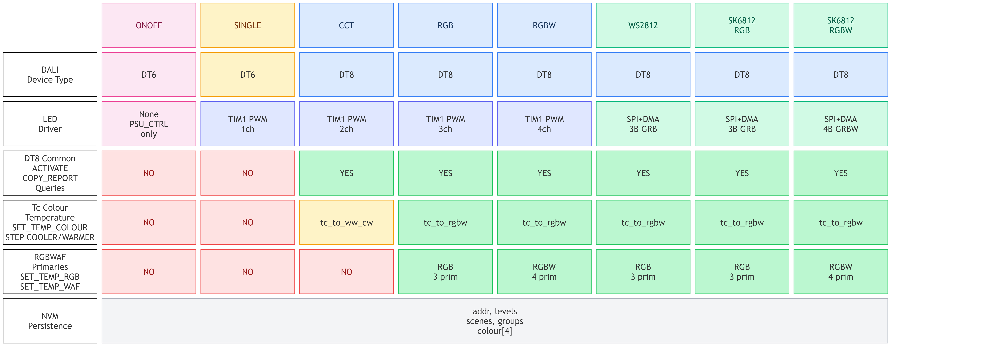

# DALI EVG Firmware

DALI-2 control gear (slave) firmware for the **CH32V003F4P6** RISC-V microcontroller, built on [cnlohr's ch32fun](https://github.com/cnlohr/ch32v003fun) framework. Drives up to 4 PWM channels (RGBW) with full DALI protocol support, DT8 colour control, and flash persistence — all in under 10 KB of code.


## EVG Modes

The firmware supports 8 LED output modes, selected via a single `EVG_MODE_xxx` define in `hardware.h` (or `-DEVG_MODE_xxx` compiler flag). All internal configuration (DALI device type, channel count, driver, DT8 features) is derived automatically.



| Mode | DT | Channels | Driver | Tc | Primary | Flash |
|------|-----|----------|--------|-----|---------|-------|
| `EVG_MODE_ONOFF` | 6 | 0 | PSU_CTRL only | - | - | 8.0 KB |
| `EVG_MODE_SINGLE` | 6 | 1 PWM | TIM1 | - | - | 8.7 KB |
| `EVG_MODE_CCT` | 8 | 2 PWM | TIM1 | yes | no | 9.7 KB |
| `EVG_MODE_RGB` | 8 | 3 PWM | TIM1 | yes | yes | 9.8 KB |
| `EVG_MODE_RGBW` | 8 | 4 PWM | TIM1 | yes | yes | 9.9 KB |
| `EVG_MODE_WS2812` | 8 | 3 (GRB) | SPI+DMA | yes | yes | 10.3 KB |
| `EVG_MODE_SK6812_RGB` | 8 | 3 (GRB) | SPI+DMA | yes | yes | 10.3 KB |
| `EVG_MODE_SK6812_RGBW` | 8 | 4 (GRBW) | SPI+DMA | yes | yes | 10.4 KB |

Default: `EVG_MODE_RGBW`. ONOFF mode compiles out all LED drivers, log table, and TIM1 — only PSU_CTRL (PA2) switches on/off. PHY_MIN = 254 (any non-zero arc level → full on). SINGLE mode compiles out all DT8 code (~1 KB savings).

## Features

- **IEC 62386-101** — Manchester-encoded physical layer at 1200 baud with DALI PHY transceiver, bus collision detection
- **IEC 62386-102** — Full DALI protocol: addressing, arc power, fading, scenes, groups, configuration
- **IEC 62386-209 (DT8)** — RGBW colour control with colour temperature (Tc) support
- **Logarithmic dimming** — IEC 62386-102 compliant 254-step lookup table
- **Flash persistence** — All configuration survives power cycles (deferred write with 5s debounce)
- **On/off mode** — PSU_CTRL-only relay/switch output, no timers or PWM
- **20 kHz PWM** — 4 channels via TIM1 with 2400-step resolution (11.2 bit)
- **WS2812/SK6812 support** — Alternative digital LED output via SPI1+DMA on PC6

## What Works

| Area | Status |
|------|--------|
| Forward frame RX (16-bit Manchester decode) | Working |
| Backward frame TX (8-bit Manchester encode) | Working |
| Short address, group, and broadcast addressing | Working |
| Full addressing protocol (INITIALISE, RANDOMISE, SEARCHADDR, PROGRAM) | Working |
| Arc power commands (DAPC, OFF, UP/DOWN, STEP, RECALL, SCENE) | Working |
| Fade engine (fadeTime + fadeRate + extended fade time) | Working |
| Configuration commands (42-128) with config repeat validation | Working |
| All standard queries (144-199) | Working |
| READ MEMORY LOCATION (cmd 197) → Memory Bank 0 (read-only gear info) | Working |
| Structured frame type (`dali_frame_t` with FORWARD/BACKWARD/ERROR/COLLISION/ECHO flags) | Working |
| TX echo / collision detection (via DALI PHY) | Working |
| Status byte (resetState, powerCycleSeen, lampOn, fadeRunning) | Working |
| 16 scenes, 16 groups | Working |
| DT8 RGBW colour control (SET TEMP RGB/WAF, ACTIVATE) | Working |
| DT8 colour temperature with Tc-to-RGBW conversion (2700K-6500K) | Working |
| DT8 queries (247-252) | Working |
| NVM flash persistence (all config + colour restored at boot) | Working |
| PSU control output (PA2, auto on/off) | Working |
| WS2812/SK6812 digital LED strip output (SPI1+DMA) | Untested |
| DALI PHY transceiver mode (default) and direct GPIO mode (`DALI_NO_PHY`) | Working |

## What Doesn't Work / Not Implemented

| Area | Reason |
|------|--------|
| Bus collision detection on direct GPIO (`DALI_NO_PHY`) | TX echo check cannot detect collisions on push-pull GPIO; use PHY mode (default) for collision detection |
| Memory bank 1 + write access | Read-only bank 0 only; writable banks not implemented |
| DALI-2 diagnostic queries (166-175) | Require hardware monitoring circuitry (current/voltage sensing) |
| CIE xy chromaticity | Requires per-LED spectral calibration |
| ENABLE DAPC SEQUENCE (cmd 9) | Rarely used, complex timing |
| Tc temperature limits (store/query) | Not yet implemented |
| controlGearFailure / lampFailure status bits | Require hardware monitoring (I2C ADC planned) |

## Hardware

```
CH32V003F4P6 (48 MHz, 16KB Flash, 2KB RAM) + DALI PHY transceiver

PC0  ── DALI RX (EXTI0, Manchester decode, via PHY RX_OUT)
PC5  ── DALI TX (GPIO, Manchester encode, via PHY TX_IN)
PD2  ── LED CH1 / Red   (TIM1_CH1 PWM)
PA1  ── LED CH2 / Green (TIM1_CH2 PWM)
PC3  ── LED CH3 / Blue  (TIM1_CH3 PWM)
PC4  ── LED CH4 / White (TIM1_CH4 PWM)
PC6  ── WS2812/SK6812 data (SPI1_MOSI, alt to PWM)
PA2  ── PSU Control (HIGH = on)
PC1  ── I2C SDA (reserved)
PC2  ── I2C SCL (reserved)
PC7  ── Boot button (active low)
PD5  ── Debug UART TX (115200 baud)
```

## Build & Flash

```bash
pio run                    # Build
pio run -t upload          # Flash via PlatformIO
# or directly:
wlink flash .pio/build/genericCH32V003F4P6/firmware.bin
```

## Resource Usage

| Resource | RGBW |
|----------|------|
| Flash | 9,668 B / 16,384 B (59.0%) |
| RAM | 136 B / 2,048 B (6.6%) |
| NVM | 64 B at 0x08003FC0 (last flash page) |

## Documentation

- [Commands_Implemented.md](Commands_Implemented.md) — Full command-by-command status table
- [firmware_architecture.mmd](firmware_architecture.mmd) — Mermaid source for architecture diagram
- [evg_mode_switch.mmd](evg_mode_switch.mmd) — Mermaid source for EVG mode feature matrix
- [test/](test/) — HIL test setup and test scripts

## License

MIT
