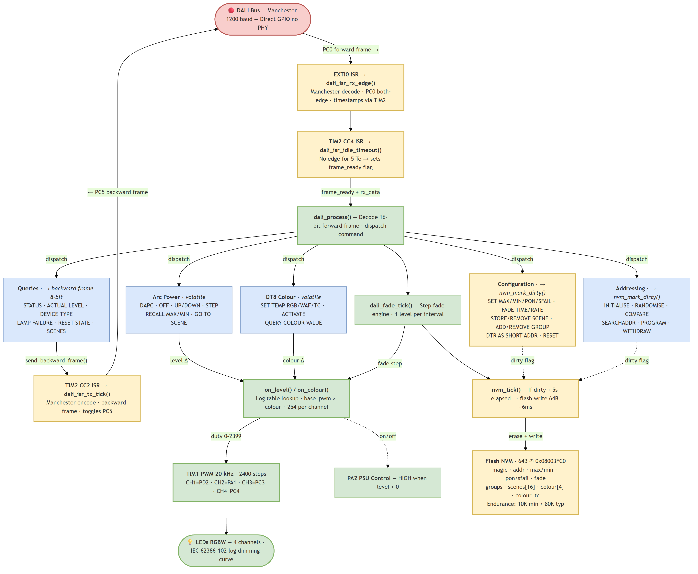

# DALI EVG Firmware

DALI-2 control gear (slave) firmware for the **CH32V003F4P6** RISC-V microcontroller, built on [cnlohr's ch32fun](https://github.com/cnlohr/ch32v003fun) framework. Drives up to 4 PWM channels (RGBW) with full DALI protocol support, DT8 colour control, and flash persistence — all in under 10 KB of code.



## Features

- **IEC 62386-101** — Manchester-encoded physical layer at 1200 baud, direct GPIO (no DALI transceiver required)
- **IEC 62386-102** — Full DALI protocol: addressing, arc power, fading, scenes, groups, configuration
- **IEC 62386-209 (DT8)** — RGBW colour control with colour temperature (Tc) support
- **Logarithmic dimming** — IEC 62386-102 compliant 254-step lookup table
- **Flash persistence** — All configuration survives power cycles (deferred write with 5s debounce)
- **20 kHz PWM** — 4 channels via TIM1 with 2400-step resolution (11.2 bit)

## What Works

| Area | Status |
|------|--------|
| Forward frame RX (16-bit Manchester decode) | Working |
| Backward frame TX (8-bit Manchester encode) | Working |
| Short address, group, and broadcast addressing | Working |
| Full addressing protocol (INITIALISE, RANDOMISE, SEARCHADDR, PROGRAM) | Working |
| Arc power commands (DAPC, OFF, UP/DOWN, STEP, RECALL, SCENE) | Working |
| Fade engine (fadeTime + fadeRate + extended fade time) | Working |
| Configuration commands (42-128) with config repeat validation | Working |
| All standard queries (144-199) | Working |
| Status byte (resetState, powerCycleSeen, lampOn, fadeRunning) | Working |
| 16 scenes, 16 groups | Working |
| DT8 RGBW colour control (SET TEMP RGB/WAF, ACTIVATE) | Working |
| DT8 colour temperature with Tc-to-RGBW conversion (2700K-6500K) | Working |
| DT8 queries (247-252) | Working |
| NVM flash persistence (all config + colour restored at boot) | Working |
| PSU control output (PA2, auto on/off) | Working |
| Direct GPIO mode (no PHY) and PHY transceiver mode | Working |

## What Doesn't Work / Not Implemented

| Area | Reason |
|------|--------|
| Bus collision detection | Not possible with GPIO-based PHY |
| DALI-2 diagnostic queries (166-175) | Require hardware monitoring circuitry (current/voltage sensing) |
| CIE xy chromaticity | Requires per-LED spectral calibration |
| ENABLE DAPC SEQUENCE (cmd 9) | Rarely used, complex timing |
| Tc temperature limits (store/query) | Not yet implemented |
| controlGearFailure / lampFailure status bits | Require hardware monitoring (I2C ADC planned) |

## Hardware

```
CH32V003F4P6 (48 MHz, 16KB Flash, 2KB RAM)

PC0  ── DALI RX (EXTI0, Manchester decode)
PC5  ── DALI TX (GPIO, Manchester encode)
PD2  ── LED CH1 / Red   (TIM1_CH1 PWM)
PA1  ── LED CH2 / Green (TIM1_CH2 PWM)
PC3  ── LED CH3 / Blue  (TIM1_CH3 PWM)
PC4  ── LED CH4 / White (TIM1_CH4 PWM)
PA2  ── PSU Control (HIGH = on)
PC1  ── I2C SDA (reserved)
PC2  ── I2C SCL (reserved)
PD5  ── Debug UART TX (115200 baud)
```

## Build & Flash

```bash
pio run                    # Build
pio run -t upload          # Flash via PlatformIO
# or directly:
wlink flash .pio/build/genericCH32V003F4P6/firmware.bin
```

## Resource Usage

| Resource | Usage |
|----------|-------|
| Flash | 9,656 B / 16,384 B (58.9%) |
| RAM | 132 B / 2,048 B (6.4%) |
| NVM | 64 B at 0x08003FC0 (last flash page) |

## Documentation

- [Commands_Implemented.md](Commands_Implemented.md) — Full command-by-command status table
- [firmware_architecture.mmd](firmware_architecture.mmd) — Mermaid source for architecture diagram
- [test/](test/) — HIL test setup and test scripts

## License

MIT
