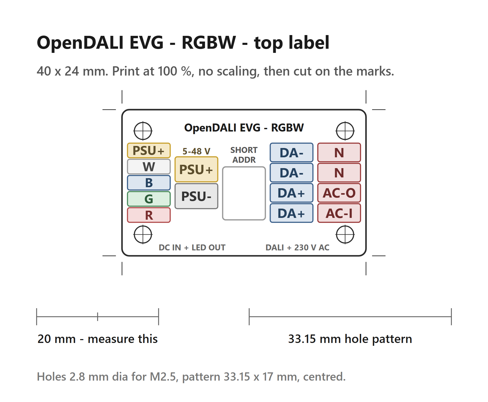

# LoadBoard 250W RGBW

LED driver and AC power switching board. Connects to the Controller via a 10-pin FFC cable (0.5 mm pitch, 25-50 mm, reverse) and provides:
- Mains switching for controlling the LED AC/DC Powersupply
- Power limits for the connected PSU: **max 1.2 A continuous** (without airflow), **max 3 A continuous** (with active airflow over the triac)
- 4-Channel PWM LED Driver (RGBW)

> **⚠ Work in progress.** This board is still under development.
>
> **MOC gate-drive supply — solved via power-ORing + power-feedback:** the MOC is bootstrapped from the DALI bus at turn-on, then taken over by an isolated 5 V rail fed back from the LED-side supply (B0505S) once the PSU is up → the bus is offloaded in steady state.
>
> **⚠ Not fully IEC 62386 compliant:** during the off→on transition the bus draw briefly exceeds the 2 mA budget (~4.1 mA) until the feedback rail takes over. Transient only, at each turn-on.

## Top label

Print [`DALI_Load_250W_RGBW_V0.2-TopLabel.png`](DALI_Load_250W_RGBW_V0.2-TopLabel.png) at 100 %, cut on the marks and clamp the 40 x 24 mm plate under the four M2.5 screws on the enclosure top — the hole pattern is 33.15 x 17 mm.

