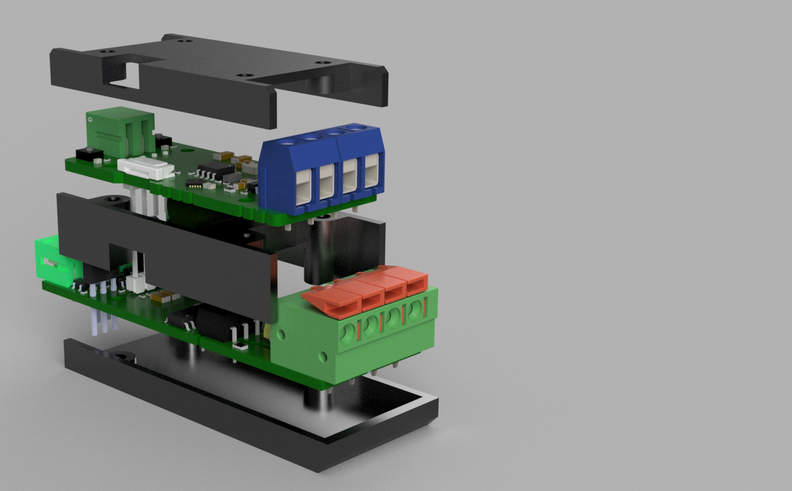

# Hardware

PCB designs for the OpenDALI_EVG project.

> Trademark notice — see [root README](../README.md): *DALI*, *DALI-2* etc. are DiiA trademarks; this project is an independent IEC 62386 implementation, not DiiA-certified.

## Boards

| Board | Description |
|---|---|
| [Controller](Controller/Readme.md) | DALI PHY + CH32V003, bus-powered. Pin assignment, J4 load-board interface, hardware validation. |
| [LoadBoard 250W RGBW](DALI_Load_250W_RGBW/Readme.md) | Mains switching and 4-channel PWM LED driver. Work in progress. |
| [LoadBoard 250W Digital LED](DALI_Load_250W_DigitalLED/Readme.md) | Mains switching and isolated single-wire output for WS2812/SK6812 strips. Work in progress. |

## Enclosure

3D-printable housing, as a Fusion 360 archive (`DALI_EVG.f3z`) and as a neutral
STEP export (`DALI_EVG.step`). One enclosure covers the Controller together with
any of the load boards above.

Ready-to-print parts are in [`stl/`](stl/) — the housing is a three-part
stack: `Bot`, `Mid` and `Top`.

Everything screws together with **M2.5 x 6 mm** screws.

Controller and load board are linked by a **10-pin FFC, 0.5 mm pitch, 50 mm,
reverse** — contacts on opposite sides at the two ends. A same-side cable
does not work: at one end its contacts face away from the connector and
never touch it.

## Manufacturing

The Gerber files are ready for upload to any PCB manufacturer. The JLCPCB files (BOM + CPL) allow direct ordering with SMT assembly through [JLCPCB](https://jlcpcb.com/).
